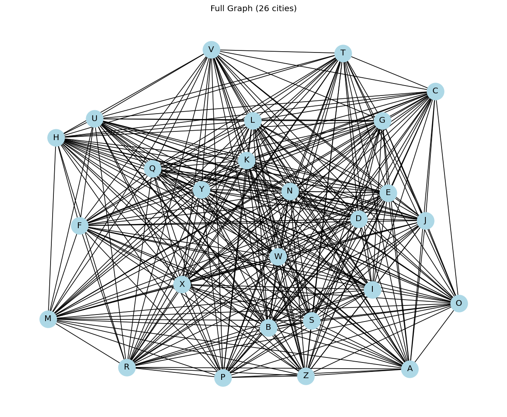
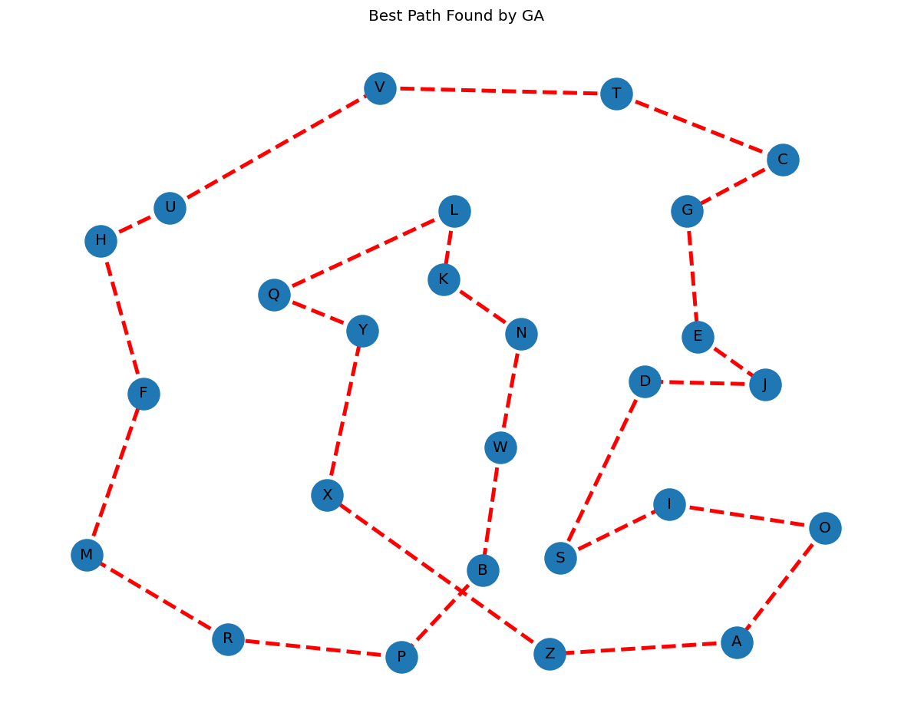
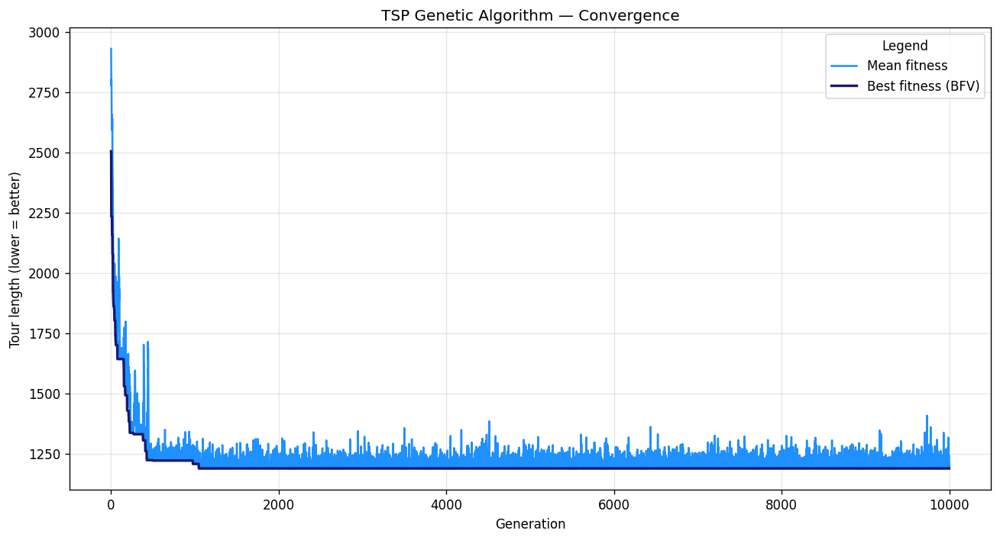

<div align="center">

# TSP Genetic Algorithm

Genetic algorithm in C++ that approximates a low-cost Hamiltonian tour over 26 cities (Travelling Salesman Problem). Python is used only to render the resulting graphs.

</div>

---

## Demo

Starting from a random tour of length **~2500**, after 10 000 generations the GA converges to a tour of length **~1190** — about **53 % shorter**.

| Full graph (input) | Best path found by GA | Convergence curve |
|---|---|---|
|  |  |  |

The dark-blue line (BFV) is the best individual found so far — it never goes up thanks to elitism. The light-blue line is the population mean: it tracks the BFV closely, which means selection + crossover + mutation are actually evolving the whole pool, not just one elite.

---

## Project layout

```
.
├── datasets/                    # CSV inputs + run outputs
│   ├── coords.csv               # (x, y) of each of the 26 cities
│   ├── adj_matrix.csv           # full graph adjacency (1 = edge)
│   ├── distances.csv            # pre-computed Euclidean distances
│   ├── means.txt                # mean fitness per generation (output)
│   ├── best_fitness_values.txt  # best fitness per generation (output)
│   ├── nodes_best_path.csv      # cities of the best tour (output)
│   └── edges_best_path.csv      # edges of the best tour (output)
├── src/
│   ├── main.cpp                 # GA driver: init pop → loop → export
│   ├── include/
│   │   ├── genetic.h            # selection, crossover, mutation, elitism
│   │   └── utils.h              # I/O, helpers, tunable constants
│   └── main.py                  # renders the three plots above
└── screenshots/                 # static PNGs used in this README
```

The whole GA is a **single-binary, single-pass** program: `main.cpp` runs the loop and writes plain CSV/TXT files into `datasets/`; `main.py` only reads those files and plots them.

---

## Quick start

### Requirements

- A C++17 compiler (`g++` or `clang++`)
- Python 3.9+

### Build & run the GA

```bash
cd src
g++ -std=c++17 -O2 -o main main.cpp
./main
```

The binary expects to be run **from `src/`** because it reads `../datasets/distances.csv` and writes back to `../datasets/`. After ~1–2 s you'll see the before/after fitness logged to stdout, and four files updated in `datasets/`.

### Plot the results

```bash
# from repo root
python -m venv .venv && source .venv/bin/activate
pip install matplotlib networkx pandas
cd src
python main.py
```

`main.py` opens three windows: the full graph, the best tour found, and the convergence curves.

---

## A 60-second intro to genetic algorithms

A genetic algorithm (GA) borrows three ideas from biological evolution to search huge solution spaces without checking every candidate:

- **Population.** Instead of optimizing a single solution, you keep a pool of them and let them compete.
- **Inheritance.** Good solutions get to combine and produce offspring that share their traits.
- **Random variation.** Every so often a small random change keeps the pool from collapsing onto a single mediocre answer.

Each "individual" is a candidate tour (a string of cities). Each generation does the same four things:

| Concept | What it does | Why it matters |
|---|---|---|
| **Selection** | Pick the better tours from the current pool. | Bad solutions die out; good ones get to pass on their structure. Without selection, the GA is just random search. |
| **Crossover** | Combine two parent tours into a child tour. | This is where progress comes from: a good "left half" of one tour gets glued to a good "right half" of another. |
| **Mutation** | Tiny random change (here: swap two cities). | Injects new genetic material so the pool can escape local optima. Without mutation, once a city is missing from every tour, it stays missing forever. |
| **Elitism** | Always carry the best individual found so far into the next generation. | Selection + crossover are stochastic and can accidentally lose the best solution. Elitism guarantees the BFV curve never goes up — the GA "remembers" its best answer. |

The general loop is just:

```
population = random_tours()
best = best_of(population)
for each generation:
    parents   = select(population)            # keep the winners
    children  = crossover(parents)            # mix them
    children  = mutate(children)              # add noise
    best      = elitism(best, best_of(children))   # never forget the champion
    population = refill(children)             # back to a full pool for next gen
```

That's the entire skeleton — everything in `genetic.h` is one concrete implementation of these five operators tailored to permutation tours (where the constraint "every city exactly once" makes plain crossover/mutation tricky).

---

## Worked example with tiny numbers

Let's run one generation by hand on a toy 6-city problem. Cities: `A B C D E F`. The pre-computed distance table:

| from\to | A | B | C | D | E | F |
|---|---|---|---|---|---|---|
| **A** | 0 | 4 | 5 | 8 | 6 | 3 |
| **B** | 4 | 0 | 2 | 7 | 9 | 5 |
| **C** | 5 | 2 | 0 | 3 | 4 | 6 |
| **D** | 8 | 7 | 3 | 0 | 5 | 4 |
| **E** | 6 | 9 | 4 | 5 | 0 | 2 |
| **F** | 3 | 5 | 6 | 4 | 2 | 0 |

### 1. Fitness = sum of edge lengths

The fitness of a tour is just the total distance walked — **lower is better**, so this is a *loss* function (no "gain"; we minimize).

> **Parent 1:** `A → B → C → D → E → F → A`
> length = 4 + 2 + 3 + 5 + 2 + 3 = **19**

> **Parent 2:** `A → F → E → D → C → B → A`
> length = 3 + 2 + 5 + 3 + 2 + 4 = **19**

Two different tours, same length — that happens. Let's add a worse one to make selection meaningful.

> **Parent 3:** `A → C → E → B → D → F → A`
> length = 5 + 4 + 9 + 7 + 4 + 3 = **32**

### 2. Selection: pair them up, keep the winner of each pair

The implementation does pairwise tournaments. Pair (Parent 1, Parent 3): `19 < 32` → **Parent 1 wins**. Parent 3 is discarded. Selection is a *pure filter*: nothing is mixed yet, the bad genes are just deleted.

### 3. Crossover: glue parts of two parents into a child

Two parents survived selection: `P1 = A B C D E F A` and `P2 = A F E D C B A`. The crossover draws a random bitmask the same length as the interior of the tour (here 5 bits, one per city `B C D E F`):

```
mask = 1 0 1 1 0
        ↑ ↑ ↑ ↑ ↑
        slot 1..5 of the child
```

For each interior slot:

- **Bit = 1** → copy that city from **the other parent**.
- **Bit = 0** → leave the slot blank for now.

Building child A (whose "other parent" is P2):

```
slot:  1   2   3   4   5
mask:  1   0   1   1   0
P1:    B   C   D   E   F
P2:    F   E   D   C   B
copy:  F   _   D   C   _    ← from P2 where mask = 1
```

Now we have `A F _ D C _ A` with two blanks. Two cities are missing: `B` and `E` (every city must appear exactly once). The implementation fills the blanks **in the order the missing cities appear in the other parent**, so the child inherits a relative ordering from both:

```
P2 order of missing: F is at idx 1 (skip, already placed) → E at idx 2 → B at idx 5
fill blanks left-to-right: first blank gets E, second blank gets B
child A: A F E D C B A
length = 3 + 2 + 5 + 3 + 2 + 4 = 19
```

This child happens to land at fitness 19 too, but in a real run the child usually lies *between* its parents — sometimes better, sometimes worse, never with duplicate cities (that's why the bitmask + missing-fill dance exists; plain bit-mixing would produce illegal tours like `A F E D F E A`).

### 4. Mutation: tiny random shake

With probability `MUTATION_RATE = 0.0625`, swap two random interior cities. Say the dice land on slots 2 and 5 of child A:

```
before: A F E D C B A         length 19
swap:       ↑       ↑
after:  A F B D C E A
length = 3 + 5 + 7 + 3 + 2 + 6 = 26
```

This particular mutation made things **worse** — and that's expected. Most mutations are noise. They're worth doing because once in a while a swap lands on a beneficial change that crossover alone could never reach (e.g. when *every* surviving parent has the same bad edge baked in).

### 5. Elitism: protect the champion

After all that, the new generation's best individual might still be worse than the all-time best (the *champion*). Elitism is the one-line safety net:

```
if best_of(new_generation) is worse than champion:
    overwrite slot 0 of new_generation with the champion
else:
    champion = best_of(new_generation)   # we have a new champion
```

Concretely with our toy run: the champion entering this generation was length 19 (from P1). After crossover + the unlucky mutation above, the best of the new generation is length 26. Without elitism, the GA just lost its 19-tour forever. **With elitism, we re-inject P1 back into slot 0** and the champion is preserved.

This is exactly why the dark-blue **BFV curve in the convergence plot is monotonically non-increasing** — elitism makes it physically impossible for the line to ever go up. The light-blue mean line, by contrast, *can* spike upwards (you can see the spikes in the plot) because it reflects the whole population, including unlucky mutants.

---

## How the algorithm works

| Stage | Where | What |
|---|---|---|
| **Genome** | `genetic.h::get_individual` | A tour is a `std::string` of 28 chars: `A` + permutation of `B..Z` + `A` (start = end). |
| **Initial population** | `genetic.h::get_initial_population` | 32 random tours, all starting at `A`. |
| **Selection** | `genetic.h::population_selection` | Pairwise tournament: split the 32 into 16 pairs, keep the shorter tour of each pair. |
| **Crossover** | `genetic.h::crossover` | Permutation-safe uniform crossover driven by a 25-bit random mask. Slots not copied from one parent are filled with the missing cities of the other parent (no duplicates). |
| **Mutation** | `genetic.h::population_mutation` | With probability `MUTATION_RATE`, swap two random interior cities of a tour. |
| **Elitism** | `genetic.h::elitism_handler` | If the best of the new generation is worse than the running best, the running best is re-injected into slot 0. |
| **Refill** | `genetic.h::refill_population` | After selection collapses 32 → 16, the pool is duplicated and shuffled back to 32 different parents for the next tournament. |

### Tunable parameters

All in `src/include/utils.h`:

| Constant | Default | Meaning |
|---|---|---|
| `N_NODES` | 26 | Number of cities (must match `coords.csv` / `distances.csv`) |
| `INITIAL_POPULATION` | 32 | Population size — kept constant across generations |
| `MUTATION_RATE` | 0.0625 | Per-genome probability of a swap mutation |
| `MAX_RANDOM_VALUE` | 33 554 432 | `2^25`, source of the 25-bit crossover mask |

Number of generations is hard-coded in `main.cpp` (`for (int i = 0; i < 10000; i++)`).

---

## Sample run

Build and run on a clean checkout:

```
$ ./main
[Before] Best path length 2504.67
[Before] Best genome:  AVWHEPBKQXJSDIRMCYZNFGUOTLA
[After]  Best path length 1188.23
[After]  Best genome:  AZXYQLKNWBPRMFHUVTCGEJDSIOA
[Delta]  Means:               2930.12 -> 1241.01
[Delta]  Best Fitness Value:  2504.67 -> 1188.23
```

Reading the convergence chart:

- **Steep drop in the first ~500 generations.** Selection + crossover quickly remove the worst tours; BFV halves while the mean follows tightly.
- **Plateau around generation 1000.** The pool has settled into a basin of attraction; mutation produces small perturbations (the spikes in the light-blue line) that elitism filters out.
- **Mean ≈ BFV at the end.** The whole population has converged, not just a single elite individual — that's the visible signature of a healthy GA.

---

## Notes & limitations

- **Local optima are real.** Without a 2-opt or `or-opt` post-processing step, the GA often plateaus with a few residual edge crossings. Tools like 2-opt would polish those out at the cost of breaking the "pure GA" framing.
- **Seed.** `srand(time(NULL))` is called once in `main`, so two runs in the same second produce identical tours. Re-run after a couple of seconds (or replace with `std::mt19937{std::random_device{}()}`) to explore different basins.
- **`distances.csv` must match `coords.csv`.** If you edit the city coordinates, regenerate the distances file by uncommenting `export_distances(pos=pos)` in `src/main.py` and running it once.

---

## Contributors

- Chillitupa Quispihuanca, Alfred Addison
- Muñoz Curi, Rayver Aimar
- Gómez del Carpio, Alexander Sebastian
- Quispe Salcedo, Josep Marko

<a href="https://github.com/RayverAimar/TSP-genetic-algorithm/graphs/contributors">
  
</a>
